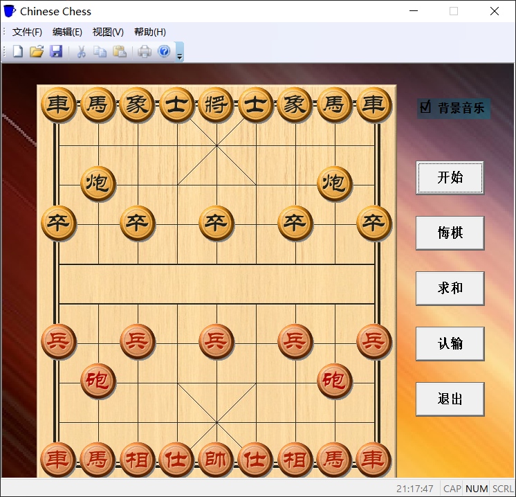
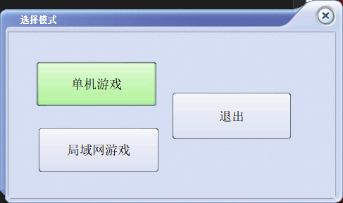
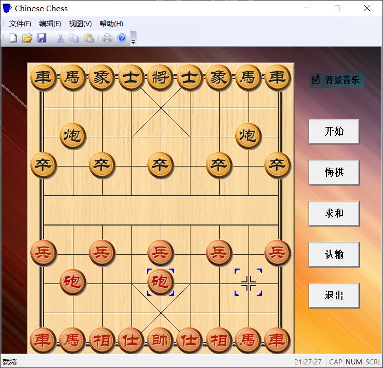
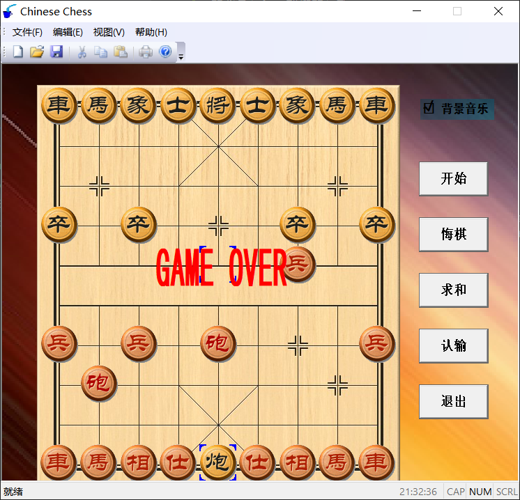
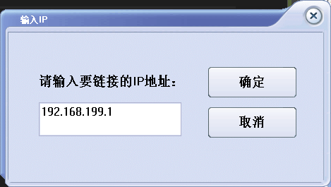
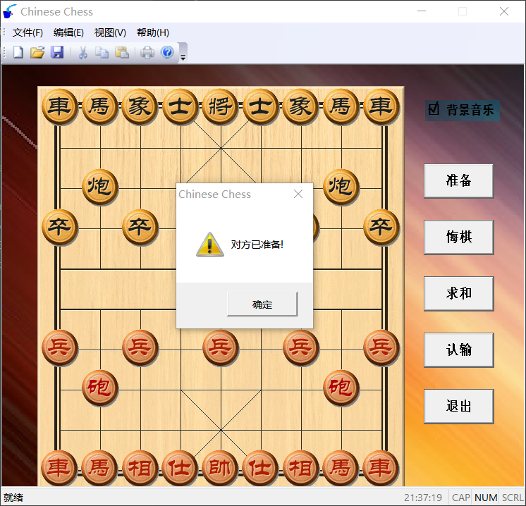

# Chinese-Chess
模仿QQ象棋设计的桌面端中国象棋，具有单机模式和联机模式，有超好听的背景音乐，超炫的音效。

## 使用教程
### 单机游戏
运行Chinese Chess.exe，选择单机游戏

点击“开始”，将初始化棋局，红色方先走。

随后，黑色方可以走，叫另一个人过来用黑色方陪你下棋（我们没有设计AI哦，这就意味着没人陪你的时候，你就需要一个人下两个人的棋）

### 联机模式
运行Chinese Chess.exe，选择局域网游戏（因为需要输入IP，因为NAT的缘故，一般只能在局域网内玩，但最起码比单人游戏有趣多了不是吗）

输入另一位玩家的IP地址，点击“确定”

当两边玩家都点击“准备”了后，会出现“对方已准备”的对话框，然后可以进行游戏

